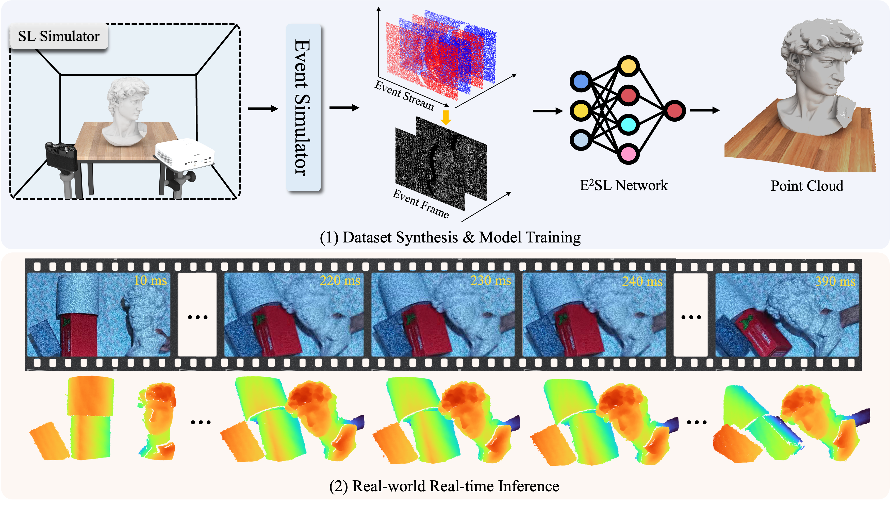

# E<sup>2</sup>SL: Efficient Depth Sensing from Event-based Structured Light


## Introduction

Structured light (SL) enables 3D reconstruction but struggles in high-speed dynamic scenes when using frame-based cameras. We propose E<sup>2</sup>SL, an efficient deep network for monocular event-based SL, combining BE-LUT for fast feature retrieval, SCE for spatial context enhancement, and GPR for robust depth estimation. Experiments on synthetic and real-world datasets show state-of-the-art accuracy with only 7.7 ms per frame, demonstrating suitability for high-speed depth sensing.

Please refer to [Project](https://github.com/Dongxin000/E2SL).

## Requirements
- Please install requirements:
`pip install requirements.txt` 

- Addtional
This project additionally relies on [custom CUDA kernels](https://github.com/SimonTheVillain/giga_depth). Therefore, a properly configured NVIDIA GPU environment is required. In particular, our implementation is built and tested with `CUDA 11`, together with a compatible PyTorch version and the necessary build tools for compiling custom CUDA/C++ extensions, e.g., `ninja`.


## Usage
- Download dataset by [link](https://pan.baidu.com/s/1eOP0dTxZbJ2Xu4zTOSq2jA?pwd=95aq).
- To start training, please specify the config file, the dataset path, and the directory for saving model checkpoints, then run:

```bash
python3 train.py --config_file=configs/E2SL.yaml --dataset_path=/path/to/dataset --model_path=/path/to/save/checkpoints
```

- For evaluation, you can run:
```bash
python3 eval.py
```


## Citation
Please cite the paper in your publications if it helps your research:

    @ARTICLE{dong2026E2SL,
        title={E2SL: Efficient Depth Sensing from Event-based Structured Light},
        author={Dong, Xin, Fu, Jiacheng, Li Yue, Weng Wenming, Zhang, Yueyi, Huang, Bingyao, and Xiong, Zhiwei},
        journal={IEEE Transactions on Visualization and Computer Graphics},
        year={2026},
    }

## Acknowledgments 
- This software and code borrows heavily from [GigaDepth](https://github.com/SimonTheVillain/giga_depth).
- We express our gratitude to the anonymous reviewers for their valuable and insightful comments and suggestions, which have been truly inspiring.
- Please don't hesitate to create an issue if you have any questions, suggestions, or concerns.

## License
This software is freely available for non-profit non-commercial use, and may be redistributed under the conditions in [license](LICENSE).